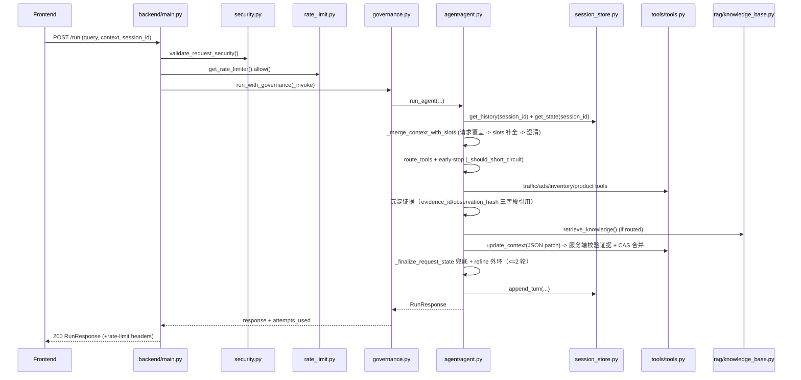
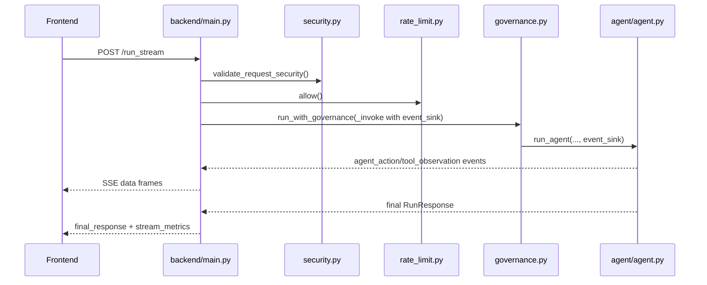
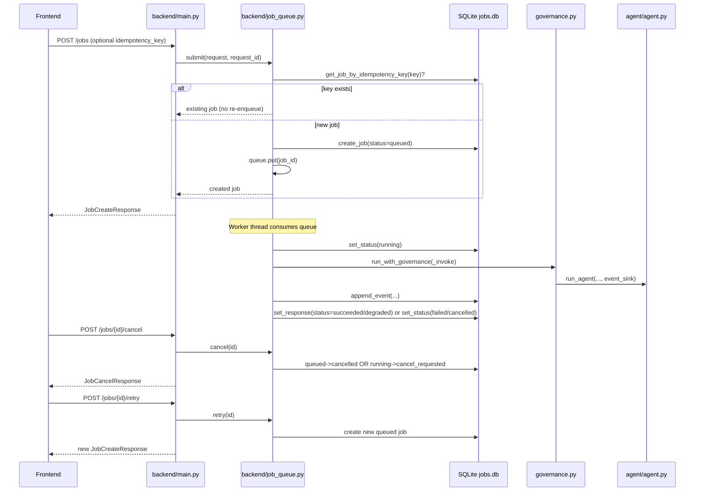

# 电商运营 AI Agent 架构设计文档

## 1. 文档信息
- 项目名称：Merchant Ops Copilot（LangChain Tool-Calling Agent）
- 技术栈：Python、FastAPI、LangChain、Redis、SQLite、Next.js、SSE、Chroma/InMemory、Sentence-Transformers

## 2. 背景与目标
本项目面向电商运营场景，用户输入业务问题（如流量下滑、ROI 下降、库存风险），系统通过 **function-calling Agent**（`create_tool_calling_agent`）与工具调用完成归因和建议输出。

核心目标：
1. 构建可运行的 Agent 工程闭环，而不仅是单次 LLM 调用。
2. 支持流式执行过程可视化（工具调用轨迹 + 关键步骤事件）。
3. 支持 RAG 检索增强，提升策略类问答的准确性。
4. 多轮诊断记忆：模型提议、服务端仲裁的结构化诊断状态，长会话不丢信息、结论可溯源。
5. 提供基础稳定性治理（限流、超时、重试、降级）与安全治理（鉴权、租户隔离、输入限制、注入拦截）。
6. 支持从单机演示平滑演进到多实例部署。

## 3. 范围与非目标
范围：
1. `/run` 同步接口与 `/run_stream` 流式接口。
2. function-calling Agent 多轮工具调用（结构化 `{query, context}` 参数）。
3. 会话短期记忆（内存/Redis）+ 结构化诊断状态（DiagnosticState，证据校验 + 版本 CAS）。
4. 异步任务 `/jobs`（取消 / 重试 / 幂等 / 重启恢复 / 事件回放）。
5. 混合检索 RAG（向量 + BM25 + RRF + 重排）。
6. 基础可观测性（结构化日志、流式指标、错误/稳定性统计）与回归测试机制。

非目标：
1. 不实现复杂 RBAC 与多租户权限系统。
2. 不实现全量任务队列调度平台（当前仍以同步执行为主）。
3. 不做训练/微调流水线。

## 4. 总体架构

```text
[Next.js Frontend]  (langchain-agent/frontend, 统一入口)
        |
        | HTTP / SSE
        v
[FastAPI Backend]
  |  校验层: 鉴权/租户隔离/限流/输入安全/超时重试降级
  |  编排层: Tool-Calling Agent (function-calling) + 工具路由 + 早停
  |  状态层: 记忆仲裁 update_state（证据校验 + 容量限制 + 版本 CAS）
  |          兜底 _finalize_request_state + refine 外环（上限 2 轮）
  v
[Tools Layer]
  | traffic_analyze / ads_analyze / inventory_check / product_diagnose / update_context / retrieve_knowledge
  v
[RAG Layer]
  | 文档加载 -> 切片 -> 向量召回 + BM25召回 -> RRF融合 -> metadata过滤 -> 重排
  v
[Stores]
  | SessionStore(memory/redis)     # 对话历史 + DiagnosticState + 证据引用
  | 身份注册表 api_keys.json       # API Key -> {user_id, tenant_id, merchant_ids}
  | JobQueue(SQLite jobs.db)       # 异步任务 + 事件回放
  | RateLimiter(memory/redis)
  | VectorStore(chroma/in_memory)
```

## 5. 模块划分

### 5.1 前端层（Next.js）
职责：
1. 输入 query/context/session_id。
2. 默认走 `/run_stream`，实时渲染执行步骤与最终建议。
3. 展示关键指标（latency、fallback、loop 等）。

### 5.2 API 层（FastAPI）
职责：
1. 提供 `POST /run`、`POST /run_stream`、`POST /jobs`、`POST /jobs/{job_id}/cancel`、`POST /jobs/{job_id}/retry`、`GET /jobs/{job_id}`、`GET /jobs/{job_id}/events`、`GET /jobs/{job_id}/stream`、`GET /health`、`GET /metrics/*`。
2. 执行通用治理逻辑：鉴权、限流、输入长度限制、注入检查。
3. 调用 `run_agent` 并封装响应模型。

### 5.3 Agent 编排层
职责：
1. function-calling 多轮推理与工具调用（`create_tool_calling_agent`，工具参数结构化 `{query, context}`）。
2. 工具路由（按 query/context 关键词筛选工具）。
3. 早停策略（单工具高置信场景快速返回：`_should_short_circuit`）。
4. 请求内工具缓存（同请求重复工具调用去重，命中时同样嵌入证据引用）。
5. 证据引用注入：每条工具 Observation 携带纯三字段 `{evidence_id, request_id, observation_hash}`，`tool_call_id` 由 `evidence_id` 后缀推导。
6. `update_context` 工具：模型提交增量 patch（JSON），服务端校验证据、合并、CAS 写回。
7. 服务端兜底：`_finalize_request_state` 确定性沉淀本轮证据；`unsatisfied` 约束触发定向 refine（`_run_refine_pass`，上限 2 轮）。

### 5.4 工具层
职责：
1. 承载业务诊断工具（流量、广告、库存、商品），输出按商家上下文确定性（`_weak_signal`），同一商家不同措辞结果恒定。
2. 暴露统一输入输出，便于 Agent 调用。
3. `update_context` 负责状态提议；`retrieve_knowledge` 对接 RAG。

### 5.5 RAG 层
职责：
1. 文档解析（支持 front matter metadata）。
2. 中文友好切片。
3. 双路召回 + 融合 + 重排。
4. 返回结构化证据片段用于 Agent 生成结论。

### 5.6 存储与缓存层
职责：
1. SessionStore 管理会话短期记忆 + 结构化诊断状态（`get_state` / `update_state`，Redis 用 WATCH+CAS，内存用全事务锁）。
2. RateLimiter 管理请求配额（会话桶 + IP 硬桶）。
3. 身份注册表（`api_keys.json` + `backend/identities.py`）提供鉴权与三层租户隔离。
4. JobQueue（SQLite `jobs.db`）持久化异步任务与事件回放。
5. 向量索引与稀疏索引缓存，减少重复构建开销。

## 6. 核心流程设计

### 6.1 `/run` 同步流程
1. 接收请求（query/context/session_id）。
2. 安全校验（API Key、长度限制、注入规则）。
3. 限流判定（会话桶 + IP 桶）。
4. 执行 `run_agent`（function-calling 工具调用 + 状态仲裁）。
5. 返回 `RunResponse(final_answer, steps, metrics)`。

### 6.2 `/run_stream` 流式流程
1. 前置校验同 `/run`。
2. 创建事件 sink，运行 Agent 时推送事件。
3. 持续输出 `agent_action/tool_observation/llm_observation/key_step/final_response/error/stream_metrics`（`key_step` 含 `first_evidence` / `context_update` / `direction_repair`）。
4. 前端边收边渲染执行过程。

### 6.3 Tool-Calling 执行流程
1. 构建 prompt（含工具清单、触发时机约束、few-shot patch 示例、会话历史与诊断状态）。
2. 进入循环：模型返回工具调用（function call）→ 校验/执行工具 → 沉淀证据（`evidence_id` / `observation_hash`）→ 注入 Observation 继续。
3. 模型可通过 `update_context` 提交增量 patch（add/supersede/reject + context_slots），服务端校验证据后合并。
4. 达到停止条件后输出 Final Answer；请求结束 `_finalize_request_state` 兜底沉淀（模型未调 update_context 也不丢基础结论）。
5. 记录步骤轨迹、证据引用与阶段耗时；迭代上限 12。
6. 流式事件除 `agent_action/tool_observation/final_response` 外，新增关键步事件 `key_step`（`first_evidence` / `context_update` / `direction_repair`）。

### 6.4 `/jobs` 异步任务流程
1. 接收任务创建请求，支持可选 `idempotency_key` 幂等提交。
2. 命中相同幂等键时复用已有任务，不重复入队。
3. 未命中时创建 `queued` 任务并入队，由后台 Worker 消费执行。
4. 支持任务取消：
   - `queued -> cancelled`
   - `running -> cancel_requested`（当前实现为协作式取消）
5. 支持终态任务重试，生成新任务并返回新 `job_id`。
6. 启动恢复机制：
   - `running -> queued`
   - `cancel_requested -> cancelled`
   - 自动重入队 `queued` 任务

### 6.5 请求时序图（基于当前实现）

#### 6.5.1 `/run` 同步链路


#### 6.5.2 `/run_stream` 流式链路


#### 6.5.3 `/jobs` 异步链路（含幂等/恢复/取消/重试）


## 7. RAG 检索流程与参数

### 7.1 文档处理
1. 读取 `RAG_DOCS_DIR`（默认 `knowledge/seed`）下 `.md/.txt`。
2. 解析 front matter metadata。
3. 切片参数：`chunk_size=450`，`chunk_overlap=80`。

### 7.2 检索流程
1. 向量召回：`similarity_search(k=fetch_k)`。
2. BM25 召回：基于本地 tf/df/avgdl 稀疏索引。
3. RRF 融合：`score += 1 / (RRF_K + rank)`，`RRF_K=60`。
4. metadata 过滤：`merchant_id/category/time_range`。
5. 轻量重排：query/context 词重叠 + metadata boost。
6. 输出 top_k（默认 `RAG_TOP_K=3`）。

### 7.3 关键配置
1. `RAG_FETCH_K=12`
2. `RAG_VECTOR_BACKEND=chroma`（失败回退 `in_memory`）
3. `RAG_EMBEDDING_MODEL=BAAI/bge-small-zh-v1.5`
4. `RAG_EMBEDDING_DEVICE=cpu`

## 8. 会话记忆设计
1. 对话历史：默认保留最近 `MAX_HISTORY_TURNS=8` 轮；内存实现为进程内字典 + 锁，Redis 实现为 `RPUSH + LTRIM + EXPIRE`。
2. 结构化诊断状态（DiagnosticState，按 `session_id` 存储）：
   - `context_slots`：商家/时间范围等输入槽位，当前请求显式 context 优先覆盖历史值。
   - `verified_findings`（带证据引用的诊断结论，`superseded` 保留审计链）、`current_candidates` / `rejected_candidates`、`validity_concerns` / `unresolved_constraints`、`next_step_plan`。
   - `constraint_status`（satisfied/unsatisfied/unchecked）、`answer_confidence`、`verified_citations`。
   - `version` 用于乐观锁 CAS（Redis WATCH/CAS，内存全事务锁）。
3. 证据引用：每次工具调用沉淀 `evidence_id` / `request_id` / `observation_hash`（三字段）；`update_context` 提议的 finding 必须引用本次请求真实执行过的证据，否则整条拒绝。
4. 兜底仲裁：请求结束 `_finalize_request_state` 把带证据的工具结论确定性提升为 findings 并回填 citations（无新增内容时 CAS 幂等跳过）；`unsatisfied` 约束触发定向 refine。
5. 会话快照：`GET /sessions/{session_id}` 返回状态快照（含 `state_version`、findings 数、归属校验）。

## 9. 稳定性与安全治理

### 9.1 稳定性
1. 超时：`REQUEST_TIMEOUT_SECONDS` 与流式超时配置。
2. 重试：失败后有限次重试 + backoff。
3. 降级：超时或错误时返回可解释降级结果。
4. 限流：固定窗口限流（会话桶 + 纯 IP 硬桶），支持 Redis/内存 fallback；`Trusted proxy` 白名单。

### 9.2 安全
1. API Key 鉴权（可开关；`api_keys.json` 身份映射，管理员 `APP_API_KEY` 拥有全部权限）。
2. 三层租户隔离（P0）：API Key → 身份（user/tenant/merchant_ids）→ session 所有者绑定 → merchant 权限；越权返回 403。
3. 输入长度限制（query/context）。
4. Prompt 注入规则拦截。
5. CORS 白名单配置。

## 10. 可观测性设计
1. 结构化日志（JSON）统一字段：`request_id/session_id/endpoint/status/latency/error_type`。
2. 分阶段指标：`llm_latency_ms/tool_latency_ms/loop_count/retrieve_hits`。
3. 流式特有指标：`ttfb_ms/event_count/event_completeness`。
4. 关键步事件：`key_step`（`first_evidence` / `context_update` / `direction_repair`）。
5. 统计接口：`/metrics/error_types`、`/metrics/stability`。

## 11. 部署架构

### 11.1 本地开发
1. 单实例 FastAPI + 可选前端（前端位于 `langchain-agent/frontend`，`npm run dev` 后访问 `:3000`）。
2. 会话默认内存；`SESSION_BACKEND=redis` 时状态跨请求闭环（需本机 Redis）。
3. 模拟工具信号按商家上下文确定性输出，本地联调可稳定复现同一结论。

### 11.2 Compose 模式
1. FastAPI + Redis。
2. 会话/限流状态外置，异步任务落 SQLite（`JOB_DB_PATH`），支持多实例演进。

## 12. 测试与质量保障
1. 单元与接口测试：`pytest`。
2. bad case 回归：固定样例脚本。
3. CI 自动化：push/PR 自动跑测试与回归门禁。
4. 回归产物归档：结果 JSON + 后端日志。

## 13. 已知限制
1. 模拟工具为确定性注入的数据，未接入真实商家数据源。
2. 会话短期记忆为窗口策略，长期记忆仅保留结构化诊断状态，未做摘要持久化。
3. 初审 `verify/restart` 外环（对置信不足结论触发生成-验证-修订）尚未落地；ReAct 命名残留（`ReActTraceCallbackHandler` 等）待清理。

## 14. 演进路线（建议）
1. ~~队列化与异步任务执行~~（已落地 `/jobs`）。
2. Agent 自省外环：verify/restart 对低置信结论进行修订。
3. 前端消费 `key_step` 事件（`first_evidence`/`context_update`/`direction_repair`）做执行步骤可视化与证据展示。
4. 会话记忆"短窗 + 摘要"混合策略与运行记录归档。
5. 检索评测体系升级（离线评测集 + 指标看板）；多实例扩容与更细粒度限流熔断策略。

## 15. 验收标准
1. 功能验收：同步/流式接口稳定可用，RAG 可返回结构化证据。
2. 记忆闭环验收：多轮会话中第二轮省略上下文不重复澄清、`state_version` 随新证据递增、findings 可溯源到真实工具证据（`evidence_id`/`observation_hash`）。
3. 稳定性验收：超时、限流、降级路径可验证。
4. 安全验收：鉴权与输入防护可触发并返回预期状态码；跨用户/跨商户访问 session、任务返回 403。
5. 质量验收：CI 绿灯（`pytest` 131 passed），真实 API 端到端（`e2e_verify.py`）与两轮探针（`real_multi_round_probe.py`）通过。
